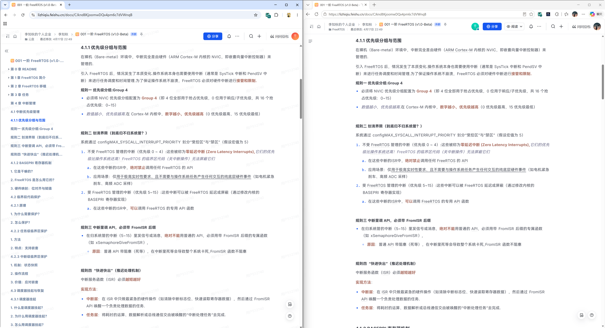
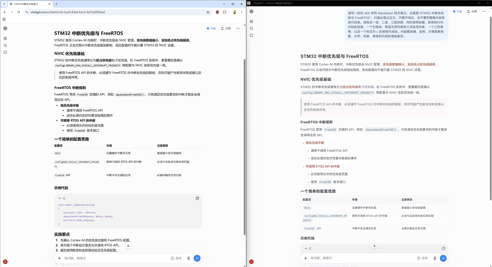
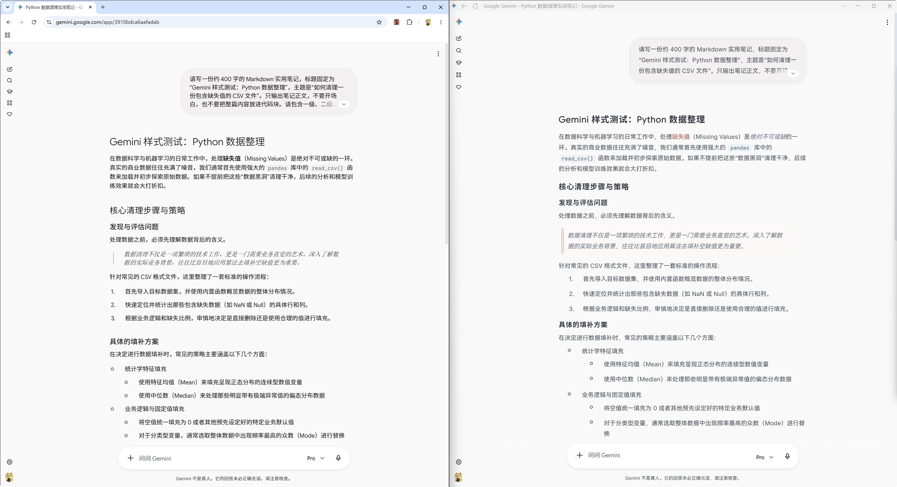
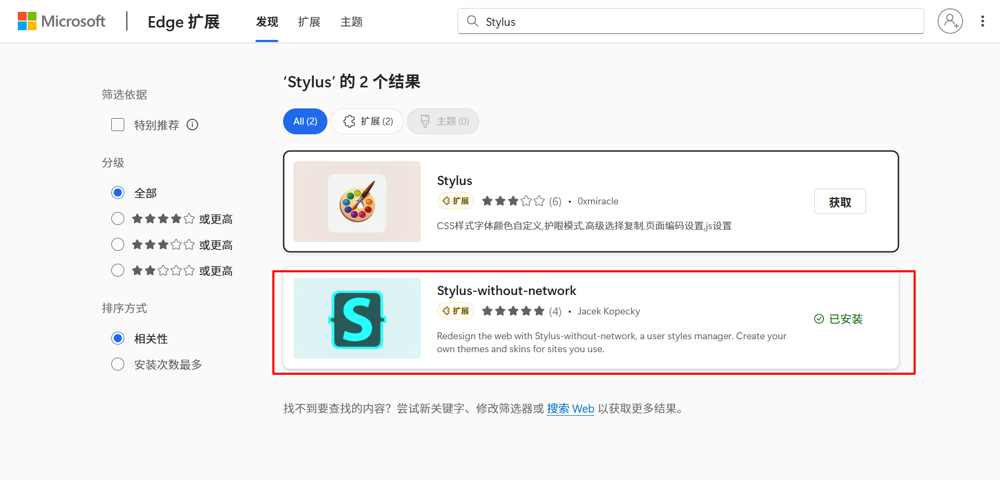
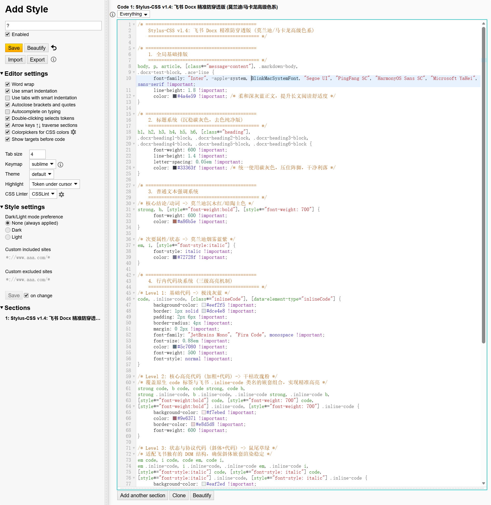
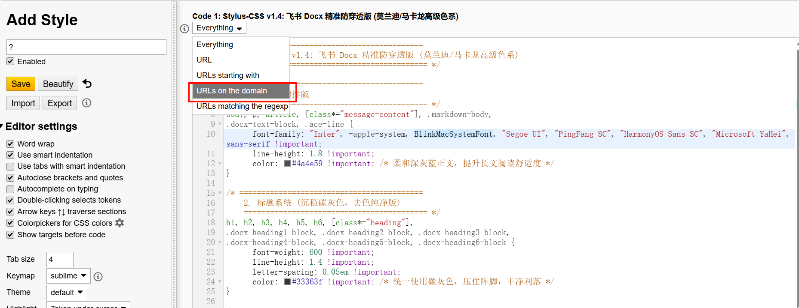
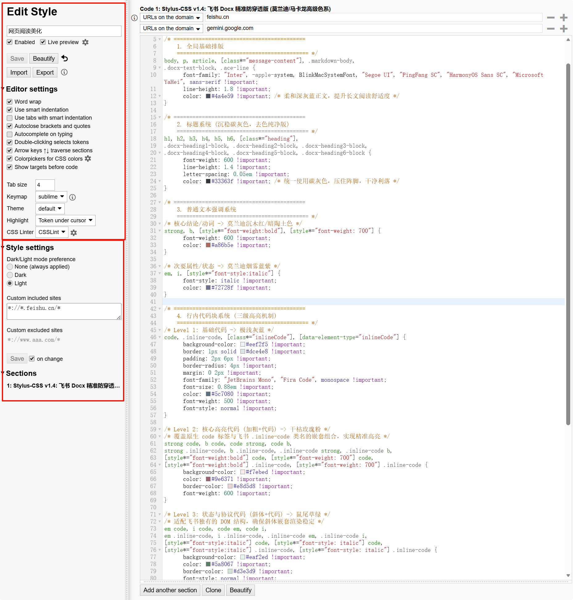

**简体中文** | [English](README.md)

# Stylus Web Reading

这是一组供 Stylus 使用的 CSS 样式，分别改善飞书文档、Gemini 和 ChatGPT 的文字、标题、列表、代码及表格显示。三个样式相互独立，可按需安装。

| 网站 | 样式文件 | Stylus 生效域名 |
| --- | --- | --- |
| 飞书 | [feishu-v1.0.css](01_Feishu/feishu-v1.0.css) | `feishu.cn` |
| ChatGPT | [chatgpt-v1.2.css](02_ChatGPT/chatgpt-v1.2.css) | `chatgpt.com`、`chat.openai.com` |
| Gemini | [gemini-v1.0.css](03_Gemini/gemini-v1.0.css) | `gemini.google.com` |

## 使用说明

### 效果对比

每张图片并排展示同一场景的原始界面与应用样式后的界面，左侧为原始显示，右侧为样式效果。

#### 飞书

#### ChatGPT

#### Gemini

### 准备工作

- 在 Chrome 或 Edge 中安装 Stylus 扩展。
- 建议安装 Inter、HarmonyOS Sans SC、JetBrains Mono 和 Fira Code 字体，以获得预期的显示效果；缺少字体时浏览器会使用系统字体。字体文件已放在仓库的 [fonts/](fonts/) 文件夹中，请按操作系统的方式安装其中的 `.ttf` 文件。

### 安装与配置

1. 首次使用可先看[视频教程](https://www.bilibili.com/video/BV1aRXzBYErj)；视频以飞书为例，ChatGPT 和 Gemini 的操作相同，只需更换 CSS 文件及生效域名。然后在 Chrome 或 Edge 的扩展商店搜索并安装 **Stylus**。

   

2. 点击浏览器工具栏中的 Stylus 图标，选择 **管理（Manage）**。

   

3. 选择 **编写新样式（Write new style）**。每个网站分别创建一个样式。

   

4. 打开上表中对应的 `.css` 文件，将完整内容复制到 Stylus 编辑器。

   ChatGPT 的 V1.0 和 V1.1 源文件仍保留在 `02_ChatGPT/`；请复制表格中的 V1.2 文件，一次只启用一个 ChatGPT 样式。V1.2 修复了独立代码块多出内层背景和边框的问题。

   

5. 在 **应用对象（Applies to）** 中选择 **此域名上的网址（URLs on the domain）**，填写上表对应的域名。ChatGPT 如需兼容两个域名，请添加两条域名规则。

   

6. 检查样式名称、**Enabled** 和 **Live preview** 状态，并确认 **Custom included sites** 只包含相应域名；**Custom excluded sites** 可留空。截图以飞书为例。

   

7. 点击 **Save**，刷新目标网站即可查看效果。

## 项目背景与联系

最初开发这个项目时，我还是一名大二学生，主攻嵌入式，并非前端方向。因为喜欢飞书，也经常使用它，我借助 AI 写下了最初的样式。后来发现同样的思路也适用于 ChatGPT 和 Gemini，便将项目拆分为三个独立版本。

我能投入的维护时间有限，项目目前还有一些问题，例如飞书代码块中加粗标题可能溢出。欢迎反馈问题、贡献代码，一起完善这个项目。

感谢 **Stylus 插件**及其开发者提供用户样式管理工具，让这些 CSS 样式得以方便地安装和使用。

### 问题反馈与缺陷提交

- GitHub 问题区：[提交问题或缺陷](https://github.com/jacelee-embdev/stylus-web-reading/issues)
- 电子邮箱：[jacelee.embdev@gmail.com](mailto:jacelee.embdev@gmail.com)
- 飞书：[添加联系人](https://www.feishu.cn/invitation/page/add_contact/?token=ea6n748d-ae1f-4026-8b11-be387b677dcf)

## 许可证

本项目采用 **MIT License** 开源许可证。

Copyright (c) 2026 JesMicro。完整条款请参阅根目录的 [LICENSE](LICENSE) 文件。
